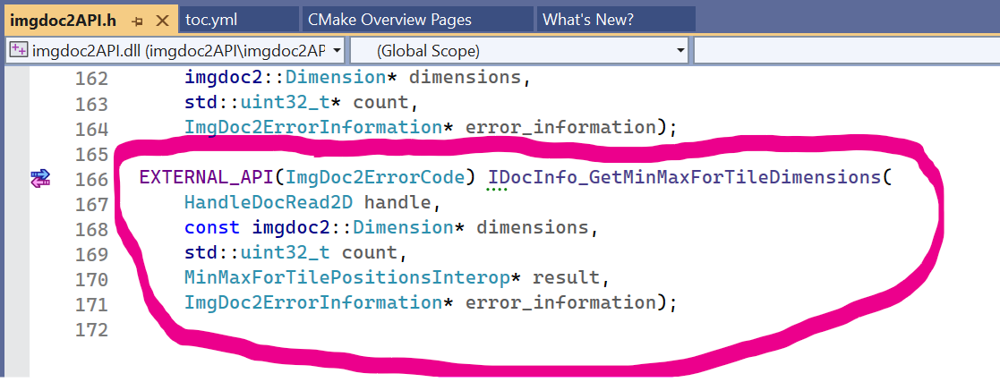
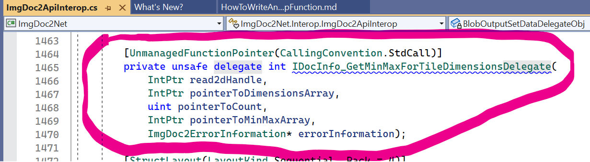
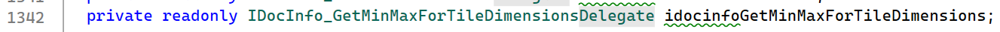
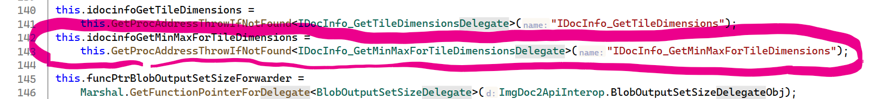

This article is walking through the steps necessary for adding a
function to the imgdoc2API-layer and exposing it a the imgdoc2Net-layer.

1. Add an exported function to the imgdoc2API.h/imgdoc2API.cpp files

An interop-function should follow those patterns:
    - it should return an ImgDoc2ErrorCode 
    - it should take a pointer to an ImgDoc2Error as the last parameter
    - all other arguments should either be primitive types or pointers to primitive types, or dedicated interop-structures.

2. Add a delegate (matching the signature of the function) to the ImageDoc2ApiInterop.cs file.

3. Add a field of the delegate type to the class.

4. Instantiate an instance of the delegate and assign it to this field in the constructor.

