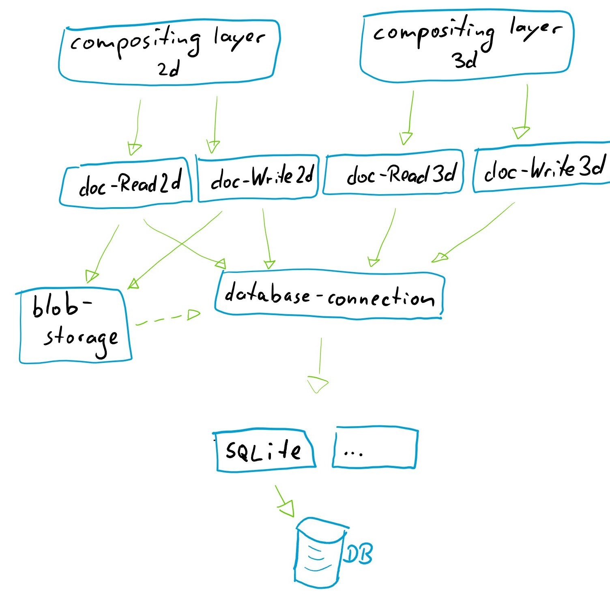
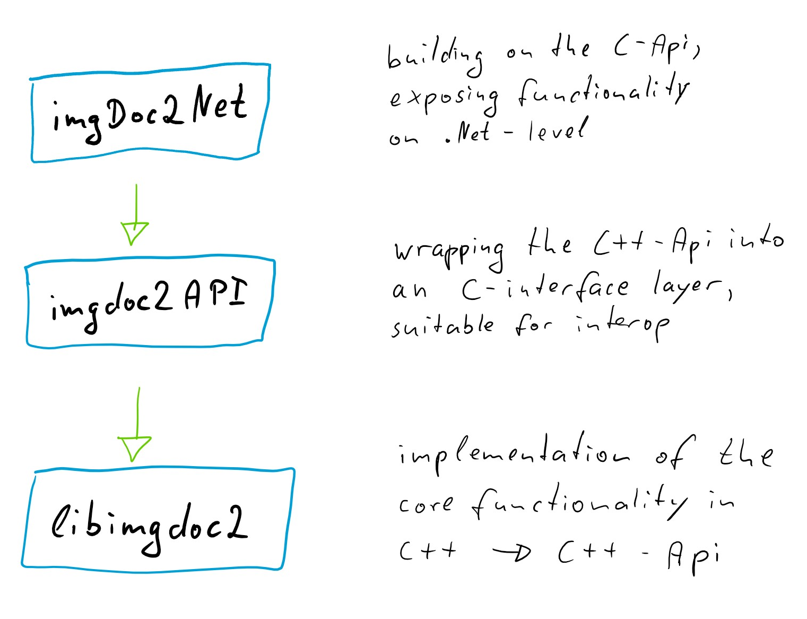

# architecture			{#architecture}

## General overview

A brief overview of the architecture is depicted here:

{html: width=60%}

At the bottom we have the database - SQLite is the primary target, but provisions are made to allow for other databases.

We have the concept of a blob-storage, which is providing a key-value access to the actual binary pixel data. This is modeled 
with the idea in mind that "the blob storage **can** be realized in the DB itself", but provisions are to be made that it is using
a different persistence layer.

Access to the database is encapsulated by the interface 'IDbConnection'. On top of this interface, the operations for reading/writing/discovering
documents are implemented. They are providing functionality to access the document on a level of the individual constituents - i.e. tiles and
metadata. They are modeled to provide the appropriate semantic for the respective document type (i.e. there is a **different** semantic/vocabulary for
different document types like "2D document"/"3D document").

On top of the document interfaces, a compositing layer is to be implemented - which is to provide the functionality of *composing* sets of tiles. It
is this layer which introduces concepts like "zoom- and pan-able access to a mosaic with pyramid", multi-channel-composition and such.

## module layers

This is a depiction of the module layers to be distinguished:

{html: width=75%}

*libimgdoc2* is the implementation of the core functionality. The module is providing a C++ API, and is implementing the interaction with the database.

*imgdoc2API* is encapsulating the C++ API (provided by libimgdoc2) into a C-like API, which is suitable for interop with other platform (in particular .NET).

*imgDoc2Net* is built on top of the C-like API provided by imgdoc2API, and is providing all functionality for a rich .NET API.