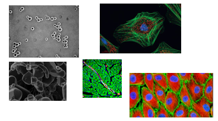
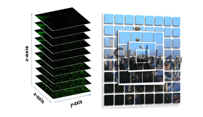
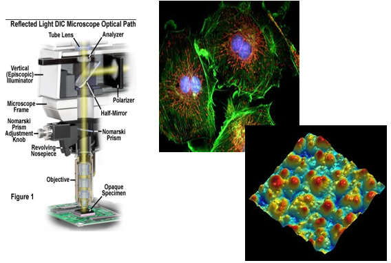

# Approach and Philosophy: Multi-Level Organization of Microscopy Image Data           {#approach_and_philosophy}

The design and implementation of imgdoc2 is based on the following principles:
-   **Modularity and Extensibility:** imgdoc2 is designed to be modular and extensible, allowing for easy integration of new features and new data formats.
-   **Flexibility:** imgdoc2 is designed to be flexible and adaptable to the needs of the user, allowing for customization of the functionalilty, capabilities and the data model.
-   **Data Agnostic:** imgdoc2 is designed to be data-agnostic, meaning that it is not limited to any specific type of microscopy data, and it is not tied to any specific file format.
-   **Standardization:** imgdoc2 is designed to facilitate standardization of the terminology and organization of microscopy image data, allowing for clear communication and understanding of image data.
-   **Interoperability:** imgdoc2 is designed to be interoperable with other software packages, allowing for easy integration with existing software tools and workflows.
-   **Open Source:** imgdoc2 is designed to be open source and freely available, allowing for easy access, modification, and extension by the scientific community.

In the following sections, we will describe the approach, principles and philosophy underlying the data model
implemented by imgdoc2.

## Multi-Level Organization of Microscopy Image Data: Emphasizing Context, Relationships, and Standardized Terminology

The following scheme is suggested as a general approach to organizing microscopy image data, where
fundamentally three levels of organization are distinguished:

| Level | Name                  | Description                                                                                                                                                                                                                                                                                                                                                                                                                                                                                            |
|-------|-----------------------|--------------------------------------------------------------------------------------------------------------------------------------------------------------------------------------------------------------------------------------------------------------------------------------------------------------------------------------------------------------------------------------------------------------------------------------------------------------------------------------------------------|
| 1     | set of images         | This level represents a collection of microscopy images that do not have any coherent relationships. These images may come from different samples, time points, or experimental conditions, and they are not explicitly linked by spatial or temporal coordinates.                                                                                                                                                                                                                                     |
| 2     | ordered set of images | At this level, we introduce the concept of "dimensions" and "coordinates" to assign e.g. spatial or temporal relationships between images. This creates an ordered set of images, where each image is associated with specific coordinates in space or time. Ordered sets of images are particularly useful for users working with time-lapse, z-stack, or multi-channel data, as it allows for easy navigation and analysis of the image data in the context of its spatial or temporal organization. |
| 3     | microscopic image     | The third and most detailed level of organization is the "microscopic image," where the specific microscopy modality used to acquire the image is explicitly defined. At this level, users provide information about the type of microscopy employed (e.g., brightfield, fluorescence, confocal, electron microscopy), as well as any pertinent settings, techniques, or experimental conditions.                                                                                                      |

| 1                                                     | 2                                                                     | 3                                                             |
|-------------------------------------------------------|-----------------------------------------------------------------------|---------------------------------------------------------------|
|  |  |  |

To facilitate clear communication and understanding of the microscopic image data, a standardized terminology 
and scheme are necessary. This structured framework will encompass all relevant terms and concepts related 
to microscopy, including sample preparation, imaging modalities, acquisition parameters, and post-processing 
techniques. By adhering to a well-defined set of terms and structures, users can accurately describe their 
image data, ensuring effective data sharing, interpretation, and analysis within the scientific community.

By incorporating these three levels of organization into our document format, we aim to provide a versatile 
solution for managing microscopy image data that caters to the diverse needs of researchers and microscopy 
applications. With a clearly defined system for organizing and describing image data, users can effectively 
store, navigate, and analyze their images while maintaining the context and details necessary for 
accurate interpretation and reproducibility.

### set of images

This level means that the is no standardized, coherent organization of the images. The ordering scheme is arbitrary or taylored for the specific application.

### ordered set of images

This level means that the images are ordered in a standardized way. The ordering scheme is standardized and can be used to navigate or compose the images.
An example of such a "standardized ordering scheme" is the concept of a spatial position - images are positioned in a coordinate system. The coordinates
assigned to the images have a defined semantic and a meaning. Concepts like "tiled-image" or "image-pyramid" are introduced at this level.

### microscopic image

This level means that the images are organized as a set of images that are taken with the same microscope. 
The microscope is defined e.g. by its modality (e.g. fluorescence), its settings (e.g. wavelength, exposure time), 
its techniques (e.g. deconvolution, stitching), its experimental conditions (e.g. temperature, pH), and its 
post-processing (e.g. contrast enhancement, segmentation).
