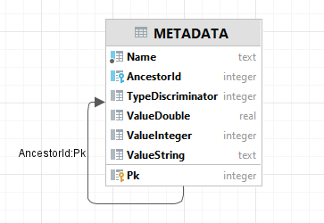
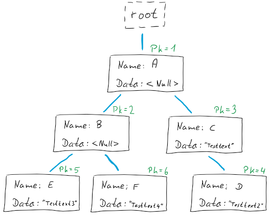
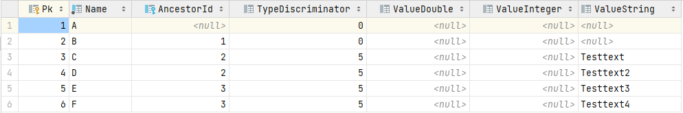

# Metatadata: technical implementation           {#metadata_technical_implementation}

## data base table layout

The implementation is providing a hierarchical key-value store. The mapping of hierarchy
to table is by following the "Adjacency List" pattern (c.f. [here](https://www.databasestar.com/hierarchical-data-sql/)).

The table layout is as follows:



We have the following columns:

| Field             | Type          | Description                                                                                                            |
|-------------------|---------------|------------------------------------------------------------------------------------------------------------------------|
| Pk                | INTEGER       | The primary key.                                                                                                       |
| Name              | TEXT NOT NULL | Name of the node.                                                                                                      |
| AncestorId        | INTEGER       | Id identifying the ancestor (or parent) of the node. If NULL this is a top-level node (i.e. the ancestor is the root). |
| TypeDiscriminator | INTEGER       | Specifies the type of the node. Currently defined values are given below.                                              |
| ValueDouble       | REAL          | If indicated by discriminator, data of type 'double' is found here.                                                    |
| ValueInteger      | INTEGER       | If indicated by discriminator, data of type 'integer' is found here.                                                   |
| ValueString       | TEXT          | If indicated by discriminator, data of type 'text' is found here.                                                      |


Currently defined discriminator values are:

| Value | Name        | Description                            |
|-------|-------------|----------------------------------------|
| 0     | Null        | Undefined                              |
| 1     | Int32       | 32-bit signed integer                  |
| 3     | doublefloat | Double precision floating point number |
| 5     | string      | UTF8-encoded text                      |
| 6     | JSON        | JSON-formatted  text                   |

What this offers is a way to store a tree of nodes, where each node has a name, a type and a value. The value can be of type 'double', 'integer' or 'string'. 
The type of the node is stored in the `TypeDiscriminator` column. The value is stored in the corresponding column. 
The name of the node is stored in the `Name` column. The `AncestorId` column is used to store the id of the parent node. 
The top-level nodes have `AncestorId` set to `NULL` (and can be thought of "child nodes of root", where this 
conceptual "root node" does not exist in the table).

As an example, consider the following tree:  


This would be stored in the following table:  


Main motivation for this design is to allow for a hierarchical structure, which allows for a natural way to structure the metadata. 
Still, it allows for fast fine-grained access to the data, as the data is stored in a single table.   

## metadata access API: C++ API

### read access

Read access is provided by the `IDocumentMetadataRead` interface.

```cpp
class IDocumentMetadataRead
{   
    virtual imgdoc2::DocumentMetadataItem GetItem(imgdoc2::dbIndex primary_key, DocumentMetadataItemFlags flags) = 0;
    virtual imgdoc2::DocumentMetadataItem GetItemForPath(const std::string& path, imgdoc2::DocumentMetadataItemFlags flags) = 0;
    virtual void EnumerateItems(
            std::optional<imgdoc2::dbIndex> parent,
            bool recursive,
            DocumentMetadataItemFlags flags,
            const std::function<bool(imgdoc2::dbIndex, const DocumentMetadataItem& item)>& func) = 0;
    virtual void EnumerateItemsForPath(
            const std::string& path,
            bool recursive,
            DocumentMetadataItemFlags flags,
            const std::function<bool(imgdoc2::dbIndex, const DocumentMetadataItem& item)>& func) = 0;
}
```    

The method `GetItem` allows to retrieve a single item by its primary key. The argument `flags` allows to specify which pieces of information
are to be retrieved. The returned structure DocumentMetadataItem contains the information that was retrieved, and it describes which fields
are actual valid. The caller should only assume that the fields that were requested are valid.  
For performance reasons, the caller should only request the information that is actually needed.   
The structure DocumentMetadataItem contains the following fields:
```cpp
 struct DocumentMetadataItem
{
    DocumentMetadataItemFlags flags;
    imgdoc2::dbIndex primary_key;
    std::string name;
    std::string complete_path;
    DocumentMetadataType type;
    IDocumentMetadata::metadata_item_variant value;
};
```
The field `flags` informs which of the other fields are valid. `complete_path` is the path to the item, starting from the (conceptual) root node.

`GetItemForPath` allows to retrieve a single item by its path. The path is a string that describes the path to the item. The path is
a string that is constructed by concatenating the names of the nodes, separated by a slash. The path is relative to the (conceptual) root node.
The path is case-sensitive. The path is not allowed to start with a slash. The path is not allowed to end with a slash. The path is not allowed to contain
two (or more) consecutive slashes (and an empty string is not allowed as the name of a node).

`EnumerateItems` is used to enumerate all items that are children of a given parent node. The argument `parent` specifies the parent node. If `parent` is `std::nullopt`,
then the root node is used. The argument `recursive` specifies whether the enumeration should be recursive (i.e. also include all children of the direct children).
The argument `flags` specifies which information should be retrieved for each item. The argument `func` is a function that is called for each item. The function
is called with the primary key of the item and the item itself. If the function returns `false`, the enumeration is stopped. If the function returns `true`, the enumeration
continues. The enumeration is performed in a depth-first manner.

`EnumerateItemsForPath` is similar to `EnumerateItems`, but it takes a path as argument instead of a primary key. The path is a string that describes the path to the item (identifying the
parent node for the enumeration). An empty string is used to specify the root node.

### write access

Write access is provided by the `IDocumentMetadataWrite` interface.

```cpp
class IDocumentMetadataWrite
{
     virtual imgdoc2::dbIndex UpdateOrCreateItem(
            std::optional<imgdoc2::dbIndex> parent,
            bool create_node_if_not_exists,
            const std::string& name,
            DocumentMetadataType type,
            const IDocumentMetadata::metadata_item_variant& value) = 0;
    virtual imgdoc2::dbIndex UpdateOrCreateItemForPath(
            bool create_path_if_not_exists,
            bool create_node_if_not_exists,
            const std::string& path,
            DocumentMetadataType type,
            const IDocumentMetadata::metadata_item_variant& value) = 0;
    virtual std::uint64_t DeleteItem(
            std::optional<imgdoc2::dbIndex> primary_key,
            bool recursively) = 0;  
    virtual std::uint64_t DeleteItemForPath(
            const std::string& path,
            bool recursively) = 0;
};
```

`UpdateOrCreateItem` allows to update or create a single item. The argument `parent` specifies the parent node. If 
`parent` is `std::nullopt`, then the root node is used. The node to be inserted or updated is specified by the argument
'name' - it is the name of a node which is a direct child of the node specified by `parent`.
The argument `create_node_if_not_exists` controls whether the node should be created if it does not exist. If the node does not exist, and
`create_node_if_not_exists` is `false`, then an exception is thrown. If the node does not exist, and `create_node_if_not_exists` is `true`, 
then the node is created.

`UpdateOrCreateItemForPath` is similar to `UpdateOrCreateItem`, but it takes a path as argument instead of a primary key. 
It has an additional argument `create_path_if_not_exists` which controls whether the path (or parts of the path) should be created if they do not exist.
In this case nodes with a type  `DocumentMetadataType::kNull` are created.

`DeleteItem` is used to delete one or more items. If the boolean argument `recursively` is `false`, then only the item specified by `primary_key` is deleted,
and it is only deleted if it has no children (otherwise an exception is thrown). If the boolean argument `recursively` is `true`, then the item specified by `primary_key`
are deleted and all children (direct and indirect) are deleted as well.

`DeleteItemForPath` is similar to `DeleteItem`, but it takes a path as argument instead of a primary key.
